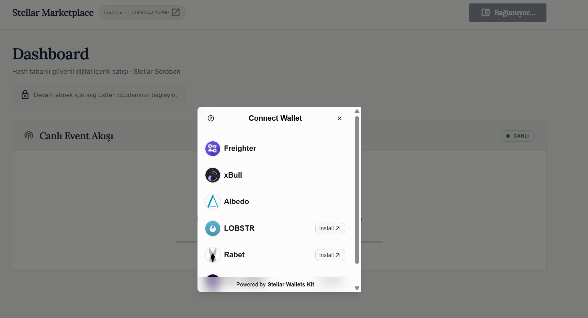
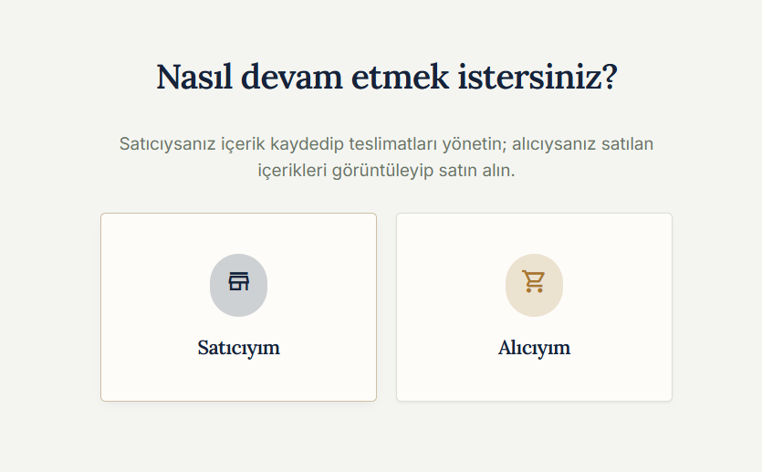
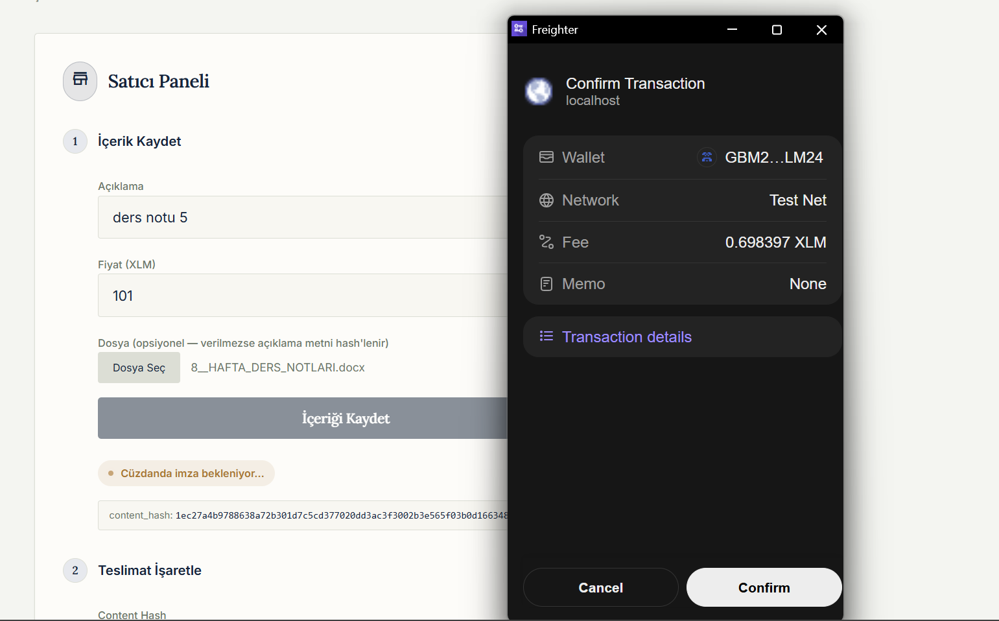
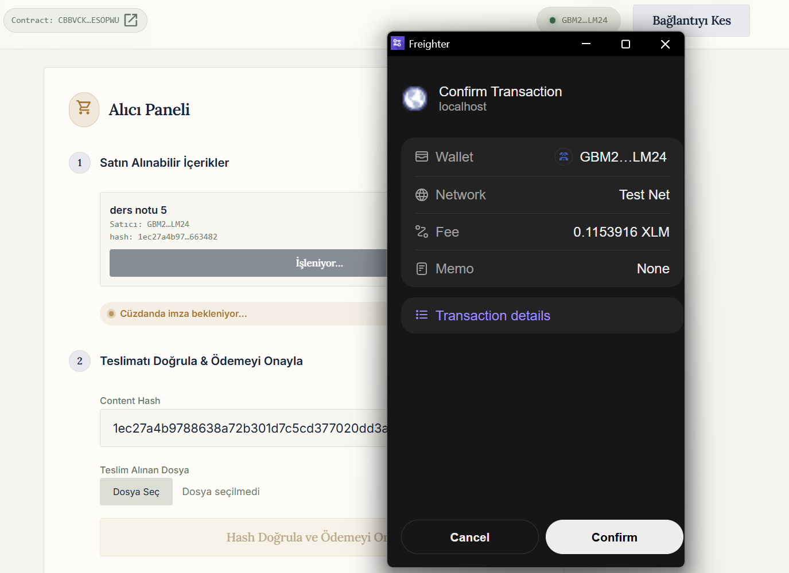
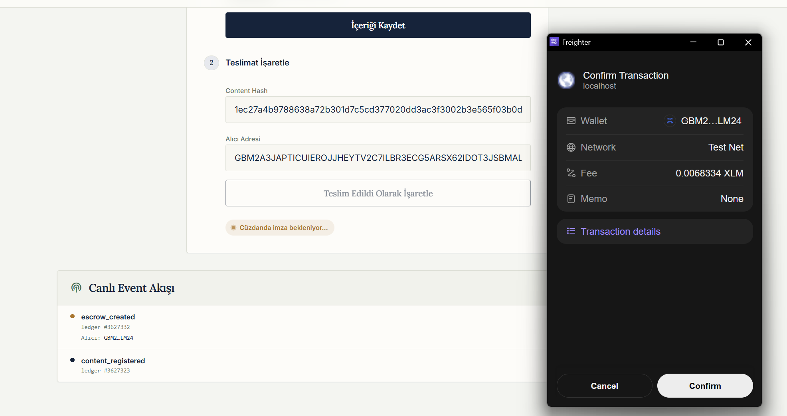
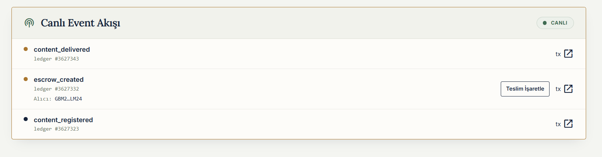
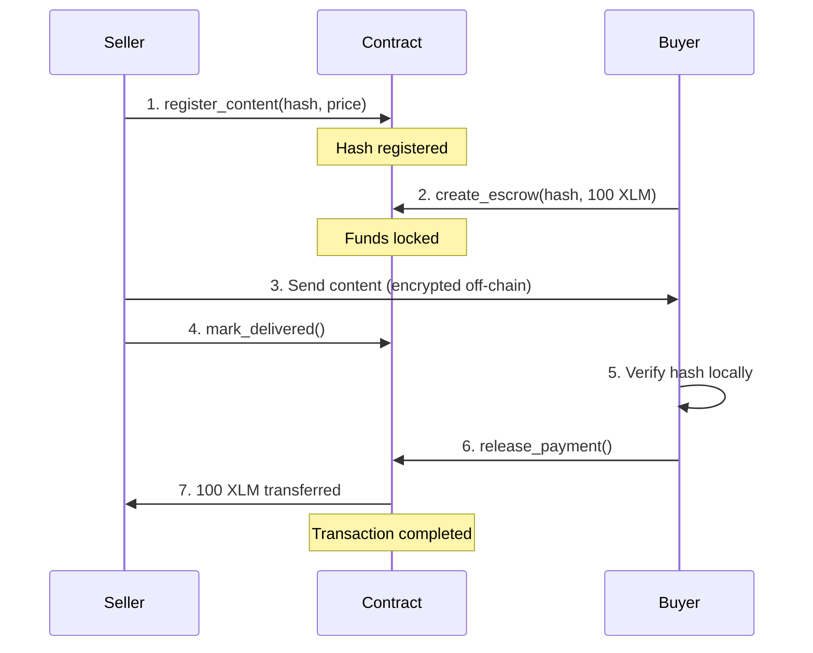

# Stellar Marketplace - Secure Digital Content Marketplace

A smart contract running on Stellar Soroban that enables the secure sale of digital content through a hash-based content verification and escrow system.

## 🟡 Level 2 Additions (Yellow Belt)

This project was extended to satisfy the Rise In Level 2 requirements: multi-wallet integration, testnet contract deployment, frontend contract calls, live transaction status tracking, and real-time event synchronization.

### Deployed contract (Stellar Testnet)

- **Contract ID**: [`CBBVCK6MLR7HPWWIJOC6IUBPHE337BOEVT2P7PSE2TEVRJHGOWESOPWU`](https://stellar.expert/explorer/testnet/contract/CBBVCK6MLR7HPWWIJOC6IUBPHE337BOEVT2P7PSE2TEVRJHGOWESOPWU)
- **Deploy transaction**: [`cd0fa265de7dcf0bc597febfd7b53116f525558b97f9c5f17ca59cbd8988cad7`](https://stellar.expert/explorer/testnet/tx/cd0fa265de7dcf0bc597febfd7b53116f525558b97f9c5f17ca59cbd8988cad7)
- **Example contract call** (`register_content`, verifiable on Stellar Expert): [`d839f8fd90be7e7367a91429118b7e5aaff9d95dfc80535cb2091e4a4085092a`](https://stellar.expert/explorer/testnet/tx/d839f8fd90be7e7367a91429118b7e5aaff9d95dfc80535cb2091e4a4085092a)

### Frontend

A React + TypeScript + Vite app in [`frontend/`](frontend) that talks to the contract above.

**Setup:**

```bash
cd frontend
npm install
npm run dev
```

Then open `http://localhost:5173`.

**What it implements:**

- **Multi-wallet support** via [StellarWalletsKit](https://stellarwalletskit.dev/) — Freighter, xBull, Albedo, LOBSTR, Rabet, and Hana all appear in the "Connect Wallet" modal (`src/lib/wallet.ts`).
- **Contract calls from the frontend** using TypeScript bindings generated with `stellar contract bindings typescript` (`packages/rise_in_contract/`, consumed as `rise-in-contract-client` — see `src/components/SellerPanel.tsx` and `src/components/BuyerPanel.tsx`).
- **Transaction status tracking** (`idle → building → signing → pending → success/error`) shown as a status pill next to every action, with a link to the tx on Stellar Expert (`src/hooks/useTxRunner.ts`, `src/components/StatusPill.tsx`).
- **3+ handled error types** (`src/lib/errors.ts`):
  1. **Wallet not found / not selected** — no extension installed or the connect modal was closed.
  2. **User rejected** — the wallet declined to sign (mapped from the SDK's `UserRejectedError`).
  3. **Insufficient balance / simulation failure** — caught from `SimulationFailedError` and from the contract's own `Result` errors (e.g. `InvalidPaymentAmount`, `ContentNotFound`), each translated to a human-readable message.
- **Real-time event synchronization** — polls `server.getEvents()` for this contract and renders a live feed (`content_registered`, `escrow_created`, `content_delivered`, `payment_released`, `refund_issued`) without a page refresh (`src/lib/events.ts`, `src/components/EventFeed.tsx`).

**Screenshot — wallet options available:**

<p align="center">
  
</p>

## 🎯 Project Overview

Stellar Marketplace is a blockchain solution that provides security and transparency in the sale of digital content (code, documents, data). Files are never uploaded to the blockchain; only their SHA-256 hashes are recorded. This ensures:- ✅ **Privacy**: Content is not visible on the blockchain
- ✅ **Verification**: Content integrity is guaranteed via hashing
- ✅ **Security**: Payment protection through an escrow system
- ✅ **Transparency**: All transactions are recorded on the blockchain

## 💻 User Interface (Frontend) Flow

Screenshots below are taken from the actual running app (`frontend/`), signing real testnet transactions with Freighter.

### 1. Connect a wallet

The user connects with any supported wallet (Freighter, xBull, Albedo, LOBSTR, Rabet).

<p align="center">
  
</p>

### 2. Choose a role

After connecting, the user picks **Seller** or **Buyer**. Each role gets its own focused screen instead of showing both flows at once.

<p align="center">
  
</p>

### 3. Register content (Seller)

The seller picks a file (or types a description), the app hashes it locally with SHA-256, and registers the hash on-chain with a price. Freighter prompts for signature.

<p align="center">
  
</p>

### 4. Browse & buy (Buyer)

The buyer sees a live catalog of everything registered on-chain (built from contract events, cross-checked with `get_content`) and buys with one click, which creates an escrow.

<p align="center">
  
</p>

### 5. Mark as delivered (Seller)

Once an escrow exists, the seller marks it delivered — the buyer's address is pulled straight from the `escrow_created` event feed, no manual copy-pasting.

<p align="center">
  
</p>

### 6. Live event feed

Every step above shows up here in real time, polled directly from the contract's on-chain events.

<p align="center">
  
</p>

## 🔐 Security Features

### 1. Hash-Based Verification```
Seller: File → SHA-256 → abc123hash... → Save to Blockchain
Buyer: Receives file → SHA-256 → Compare → If matches, approve
```

### 2. Escrow Protection- Funds are neither with the buyer nor the seller → Controlled by the Contract
- The seller cannot receive the funds until the buyer approves
- If delivery is not made within 24 hours, the buyer can get a refund

### 3. Asymmetric Encryption (Off-Chain)```
Seller:
1. Encrypts content with AES-256
2. Encrypts the AES key with the buyer's Ed25519 public key
3. Sends encrypted content + encrypted key → To the buyer

Buyer:
1. Decrypts the key using their own private key
2. Decrypts the content using the AES key
3. Verifies the hash
4. Approves the payment

Result: No man-in-the-middle can steal the content
```

## 📊 System Flow



### Alternative Flow: Timeout```
If the seller does not deliver within 24 hours:
Buyer → refund_timeout() → Funds are refunded
```

## 🏗️ Technical Architecture

### Data Structures#### ContentInfo (Persistent Storage)

```ruststruct ContentInfo {
    seller: Address,           // Seller's address
    content_hash: BytesN<32>,  // SHA-256 hash
    price: i128,               // Price (in stroops)
    description: String,       // Content description
    registered_at: u64,        // Registration timestamp
}
```

#### EscrowAgreement (Persistent Storage)

```ruststruct EscrowAgreement {
    content_hash: BytesN<32>,
    seller: Address,
    buyer: Address,
    amount: i128,
    state: EscrowState,        // Locked/Delivered/Completed/Refunded
    created_at: u64,
    timeout_at: u64,           // created_at + 24 hours
    delivered_at: Option<u64>,
}
```

#### ContractStats (Instance Storage)

```ruststruct ContractStats {
    total_contents: u64,       // Total registered content
    total_escrows: u64,        // Total number of escrows
    total_completed: u64,      // Completed transactions
    total_volume: i128,        // Total transaction volume
}
```

### Storage Strategy| Data Type | Storage Type | TTL | Reason |
|-----------|-------------|-----|--------|
| ContentInfo | Persistent | 1 year | Critical record, needs to be stored long-term |
| EscrowAgreement | Persistent | 60 days | Financial data, required post-transaction |
| ContractStats | Instance | 60 days | Global state, cheaper to maintain |

**Optimization**: Instance storage is ~70% cheaper than Persistent storage.

## 🔧 Core Functions

### 1. Content Registration

```rustfn register_content(
    seller: Address,
    content_hash: BytesN<32>,
    price: i128,
    description: String
) -> Result<(), Error>
```

**Security Checks:**
- ✅ Only the seller can register their content (`seller.require_auth()`)
- ✅ Hash must be unique (duplicate check)
- ✅ Price must be > 0

### 2. Escrow Creation

```rustfn create_escrow(
    buyer: Address,
    content_hash: BytesN<32>,
    token: Address,
    amount: i128
) -> Result<(), Error>
```

**Security Checks:**
- ✅ Buyer authentication
- ✅ Price validation (amount == content.price)
- ✅ Token transfer (buyer → contract)
- ✅ Sets a 24-hour timeout

### 3. Mark as Delivered

```rustfn mark_delivered(
    seller: Address,
    content_hash: BytesN<32>,
    buyer: Address
) -> Result<(), Error>
```

**Security Checks:**
- ✅ Only the seller can mark it
- ✅ Escrow must be in the Locked state

### 4. Payment Release

```rustfn release_payment(
    buyer: Address,
    content_hash: BytesN<32>,
    token: Address
) -> Result<(), Error>
```

**Security Checks:**
- ✅ Only the buyer can approve
- ✅ Escrow must be in the Delivered state
- ✅ Token transfer (contract → seller)

### 5. Timeout Refund

```rustfn refund_timeout(
    buyer: Address,
    content_hash: BytesN<32>,
    token: Address
) -> Result<(), Error>
```

**Security Checks:**
- ✅ 24 hours must have passed
- ✅ Escrow must be in the Locked state (no delivery made)
- ✅ Token transfer (contract → buyer)

## 🧪 Testing Strategy

### Unit Tests

#### 1. Content Registration Tests- ✅ `test_register_content_success`: Successful registration
- ✅ `test_register_content_duplicate`: Duplicate hash check
- ✅ `test_register_content_invalid_price`: Invalid price check

#### 2. Escrow Creation Tests- ✅ `test_create_escrow_success`: Successful escrow creation
- ✅ `test_create_escrow_content_not_found`: Content does not exist
- ✅ `test_create_escrow_wrong_amount`: Incorrect payment amount

#### 3. Delivery Tests- ✅ `test_mark_delivered_success`: Successful delivery marking
- ✅ `test_mark_delivered_unauthorized`: Unauthorized marking attempt

#### 4. Payment Release Tests- ✅ `test_release_payment_success`: Successful payment
- ✅ `test_release_payment_not_delivered`: Attempted payment without delivery

#### 5. Timeout Tests- ✅ `test_refund_timeout_success`: Successful refund
- ✅ `test_refund_timeout_too_early`: Premature refund attempt
- ✅ `test_refund_after_delivery`: Refund attempt after delivery

#### 6. Integration Tests- ✅ `test_multiple_buyers_same_content`: Multiple buyers for one item
- ✅ `test_complete_happy_path`: End-to-end flow test

### Running Tests

```bashcd rise-in-contract
cargo test
```

### Test Coverage

```bashcargo tarpaulin --out Html
```

## 🚀 Installation & Build

### Prerequisites

```bash# Install Rust
curl --proto '=https' --tlsv1.2 -sSf https://sh.rustup.rs | sh

# Install Soroban CLI
cargo install --locked soroban-cli

# Add WASM target
rustup target add wasm32-unknown-unknown
```

### Building

```bashcd rise-in-contract

# Optimized build
cargo build --target wasm32-unknown-unknown --release

# Optimize for Soroban
soroban contract optimize \
  --wasm target/wasm32-unknown-unknown/release/rise_in_contract.wasm
```

### Deployment (Testnet)

```bash# Deploy Contract
soroban contract deploy \
  --wasm target/wasm32-unknown-unknown/release/rise_in_contract.optimized.wasm \
  --source SELLER_SECRET_KEY \
  --network testnet

# Output Contract ID:
# CXXXXXXXXXXXXXXXXXXXXXXXXXXXXXXXXXXXXXXXXXXXXXXXXXXXXXXXXX
```

## 📝 CLI Usage Example

*(Note: These actions can also be performed via the web UI)*

### 1. Register Content (Seller)

```bash# Hash the file locally
sha256sum my_code.zip
# Output: abc123def456... my_code.zip

# Register on contract
soroban contract invoke \
  --id CONTRACT_ID \
  --source SELLER_SECRET \
  --network testnet \
  -- register_content \
  --seller SELLER_ADDRESS \
  --content_hash abc123def456... \
  --price 1000000000 \
  --description "Premium Code Package"
```

### 2. Purchase (Buyer)

```bashsoroban contract invoke \
  --id CONTRACT_ID \
  --source BUYER_SECRET \
  --network testnet \
  -- create_escrow \
  --buyer BUYER_ADDRESS \
  --content_hash abc123def456... \
  --token NATIVE_TOKEN_ADDRESS \
  --amount 1000000000
```

### 3. Delivery (Seller)

```bash# Off-chain: Encrypt and send content
# Example: openssl enc -aes-256-cbc -in file.zip -out file.enc

# On-chain: Mark as delivered
soroban contract invoke \
  --id CONTRACT_ID \
  --source SELLER_SECRET \
  --network testnet \
  -- mark_delivered \
  --seller SELLER_ADDRESS \
  --content_hash abc123def456... \
  --buyer BUYER_ADDRESS
```

### 4. Approval (Buyer)

```bash# Off-chain: Verify hash
sha256sum received_file.zip
# Does it match? Yes → Approve

# On-chain: Release payment
soroban contract invoke \
  --id CONTRACT_ID \
  --source BUYER_SECRET \
  --network testnet \
  -- release_payment \
  --buyer BUYER_ADDRESS \
  --content_hash abc123def456... \
  --token NATIVE_TOKEN_ADDRESS
```

## 🎓 Learning ObjectivesThrough this project, you will learn:

### Soroban Fundamentals
- Contract structure and lifecycle
- Storage types (Persistent/Instance/Temporary)
- TTL management

### Security Principles
- Authentication (`require_auth()`)
- State machine patterns
- Reentrancy protection (built-in for Soroban)

### Economic Design
- Escrow patterns
- Timeout mechanisms
- Gas optimization

### Test-Driven Development (TDD)
- Unit testing
- Integration testing
- Edge case handling

## 🔍 Advanced Topics

### Gas Optimization

```rustRust// ❌ Bad: Reading from storage multiple times
for i in 0..10 {
    let data = Storage::get_data(&env);
    // ...
}

// ✅ Good: Read once, keep in memory
let data = Storage::get_data(&env);
for i in 0..10 {
    // use data
}
```

### Event Emission

```rustRustenv.events().publish(
    (String::from_str(&env, "payment_released"), buyer),
    (content_hash, seller, amount),
);
```

The frontend can listen to these events to send real-time notifications.

## 🤝 Contributing

1. Fork the repository
2. Create your feature branch (`git checkout -b feature/amazing`)
3. Commit your changes (`git commit -m 'Add amazing feature'`)
4. Push to the branch (`git push origin feature/amazing`)
5. Open a Pull Request

## 📄 License

MIT License - See the LICENSE file for details.

## 🙏 Acknowledgements

- Stellar Development Foundation
- Soroban Documentation
- Rise In Community

## 📞 Contact

For any questions:
- **GitHub Issues**: [themlie/stellar-escrow-marketplace/issues](https://github.com/themlie/stellar-escrow-marketplace/issues)

---

**Note**: This project is for educational purposes. A professional security audit should be conducted before using it in production.
